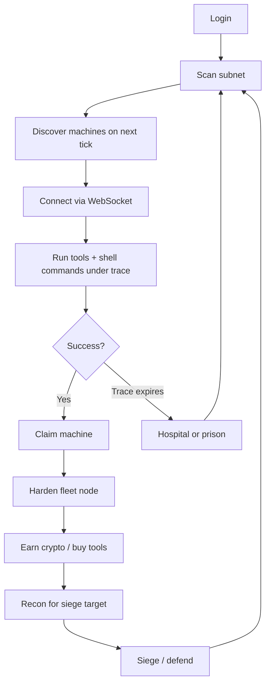
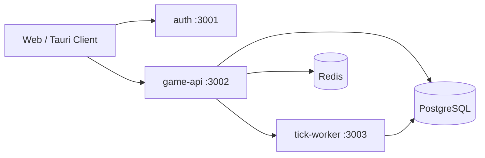

# Port 0 — AI Project Brief

> **Audience:** An AI assistant with no access to the codebase or prior conversation context.  
> **Purpose:** Provide enough design, architecture, and behavioral detail to reason about features, bugs, and tradeoffs without reading source files.  
> **Last updated:** 2026-07-08

---

## 1. One-paragraph summary

**Port 0** is a **server-authoritative multiplayer MMO hacking simulation** inspired by the spirit of *Uplink*. Players operate from a personal **rig** (their untouchable home base) in a **persistent shared network** of simulated machines. They scan subnets, break into targets under **real-time trace pressure**, claim servers into a **fleet**, earn **crypto**, buy tools, harden assets, and engage in **async PvP sieges** against other players. The game deliberately mixes **wall-clock hacking** (seconds matter) with **15-minute economy ticks** (scans, income, market, heat decay). At MVP the world is a **single subnet** with ~300 procedural machines plus a few handcrafted landmarks. Players share the world but operate solo — no chat, groups, or leaderboards at launch.

---

## 2. What Port 0 is and is not

### Is

- A persistent multiplayer hacking MMO with a simulated internet of machines
- A multi-window, terminal-driven operator fantasy (classic Uplink-style UI)
- A game where multitasking, recon, and resource management are core skills
- A shared economy with real stakes — except the home rig, which cannot be destroyed
- A long-term platform designed to scale from one subnet to a global network

### Is not

- Realistic infosec training or a CTF platform
- A single-player story game with optional multiplayer bolted on
- A chat-first social MMO (no comms at MVP)
- Pay-to-win (monetization deferred)
- A game where your home base can be sieged or lost

---

## 3. Design pillars

These pillars should guide every design and implementation decision.

| # | Pillar | Meaning |
|---|--------|---------|
| 1 | **Rig vs. drones** | The **rig** is the player's personal, untouchable workstation — powerful individually, upgraded via cyberware/software. **Drone servers** are fleet assets: weak alone, strong in numbers. A server cannot hack itself; coordinated fleets provide attack power in sieges. |
| 2 | **Multitasking under pressure** | Real-time hacks use wall-clock timers. Limited RAM/CPU, multiple UI surfaces, and a trace countdown reward efficiency — running a password cracker while extending trace with a blocker while typing shell commands. |
| 3 | **Hybrid time** | **Real-time** for active hack sessions. **Tick-based** (every 15 minutes) for economy, scans, offline progress, heat decay, siege resolution, and world simulation. |
| 4 | **Layered depth** | Weak targets expose shortcuts (e.g. `assume superuser backdoor` on CheapServer OS). Advanced targets need tool chains, forensics, and configuration. Claimed servers get hardened — the world gets harder as players secure territory. |
| 5 | **Faction consequences** | Who you hack determines punishment when caught. Shady/criminal targets → **hospital**. Government/corporate targets → **prison**. Subnet **heat** accumulates from failed hacks. Consequences are mechanical, not cosmetic. |
| 6 | **Living network** | One shared world. Ownership changes hands. Scans reveal targets. Economy ticks while offline. Other players shape the map through claims, losses, and sieges even without direct communication. |

---

## 4. MVP scope boundary

**MVP = one subnet, vertical slice of the full core loop.**

The MVP must prove this loop in a shared world:

```
scan → discover → connect → hack under trace → claim → harden → earn crypto → expand fleet → siege/defend
```

### In scope (MVP)

| Area | Details |
|------|---------|
| **World** | One zone/subnet: **Shady Hollow** (residential, mixed shady). IPv6 prefix `2001:db8:1:7::/64`. **300** proc-gen machines + **3** landmarks. |
| **Gameplay** | Rig-powered tick scans; real-time hack sessions with trace; tools with RAM/CPU limits; shell sim on 3–5 OS archetypes; numeric security component levels; claim + hardening; hospital/prison; subnet heat; async sieges with interactive defense window; hidden ownership with ≥2 recon paths; virus crafting (≥1 effect type); NPC market; single crypto economy; stock tick movement with ≥1 mission hook; throw-in-deep onboarding. |
| **Player class** | **Operator only** (implicit default). Alternate classes (e.g. Steamer) are post-MVP. |
| **Multiplayer** | Shared world, solo ops. No comms, leaderboards, or groups. |
| **Client** | Web client with multi-surface Uplink-style UI; Tauri desktop wrapper (web-first OK); OAuth login; minimal SFX. |
| **Backend** | Three services: `auth`, `game-api`, `tick-worker`. Server-authoritative validation. Cloud deploy (Fly.io). |

### Explicitly out of scope (MVP)

Multiple subnets/zones, player classes, P2P market, player contracts/escrow, groups/crews, chat, leaderboards, full virus catalog, corporate counter-hack (full), designer authoring tools, full event sourcing, monetization.

### MVP success criteria

A new player can, without developer help:

1. Log in via OAuth  
2. Scan the subnet and discover machines  
3. Hack an L1 target under trace pressure using multiple tools  
4. Claim and harden a server  
5. Earn crypto and buy a better tool  
6. Be caught and serve hospital or prison time  
7. Participate in a siege (attack or defend)  
8. Craft a virus and deploy it in a siege  

---

## 5. Core entities and terminology

| Term | Definition |
|------|------------|
| **Account** | OAuth-linked player identity with rig stats, crypto balance, installed tools, fleet, and status (free, hospital, prison). |
| **Rig** | Personal workstation. Has CPU, RAM, installed tools. Cannot be attacked or claimed. Powers hack sessions. |
| **Machine / node** | A simulated server on the network, identified by **IPv6**. Has OS archetype, security components, resources, optional owner, geographic coordinates (for world map display — unrelated to IP). |
| **Fleet** | Machines owned by a player. Provide passive income, siege attack/defense capacity, and upkeep costs. |
| **Subnet** | A `/64` IPv6 network slice. MVP has exactly one: Shady Hollow. |
| **Landmark** | Handcrafted machine with a fixed role (contract giver, market-adjacent, decoy, etc.). |
| **Hack session** | Real-time connection to a target machine. Server simulates shell, tools, trace, and claim. |
| **Tick** | 15-minute world update cycle processed by `tick-worker`. |
| **Heat** | Subnet-wide attention level from caught hacks; increases trace speed. |
| **Trace** | Countdown until authorities catch the player during an active hack. |
| **Siege** | Async PvP attack on another player's fleet node; has an interactive defense window then tick-based resolution. |
| **Recon / intel** | Partial ownership fingerprints needed before declaring siege (configurable). |
| **Crypto** | Single in-game currency. Earned from drones, loot, contracts; spent on tools, upkeep, fines. |
| **Security components** | Numeric levels (typically 0–5): `password`, `firewall`, `alarm`, `encryption`, `antivirus`. Tools must meet or exceed target levels. |
| **OS archetype** | Template defining shell behavior, default security, filesystem flavor, and **faction**. |
| **Faction** | `shady`, `criminal`, or `government` — derived from OS archetype; determines punishment type. |
| **Operator** | Default player class: direct hack → claim → fleet loop. |
| **Steamer** | Post-MVP alternate class: grow fans who install voluntary nodes (social fleet growth). Documented as an idea only. |

---

## 6. The world

### Subnet: Shady Hollow

- **Theme:** Residential, mixed shady activity  
- **Addressing:** Real IPv6 (`2001:db8:1:7::/64`)  
- **Population:** 300 procedurally generated machines + 3 landmarks  
- **Generation:** Seeded deterministic proc-gen (same seed → same world). Machines get random OS archetype (weighted), L1 security components, resources, root password, and geographic coordinates (jittered around real-world city anchors for the world map).

### Landmarks (MVP)

| ID | Name | Role |
|----|------|------|
| `bobs_plumbing` | Bob's Plumbing HQ | Contract giver |
| `shady_isp` | Shady Hollow ISP | Market-adjacent |
| `community_hub` | Block 7 Community Hub | High-traffic decoy |

### OS archetypes (MVP)

| Archetype | Typical faction | Notes |
|-----------|-----------------|-------|
| `cheap_server` | shady | Weakest; supports script-kiddy shortcuts like `assume superuser backdoor` |
| `generic_linux` | criminal | Standard Linux-style shell |
| `corp_workstation` | government | Corporate logs; higher punishment risk |
| `mainframe` | government | Tiered high-security target |

### Machine security model

Each machine has numeric component levels. Tools declare `max_security_level` and `target_type` (password, firewall, service/alarm, logs, ownership, subnet). A tool can only affect a component if `tool.max_security_level >= target_component_level`.

Public API returns **fingerprints** before full recon (OS, security summary, landmark flag, geo coords) — not ownership.

---

## 7. Gameplay loops

### 7.1 Operator core loop (tick + realtime)



### 7.2 Hack session loop (real-time)

1. Player selects a machine and **connects** (WebSocket to game-api).  
2. Server creates authoritative session state; client displays shell prompt and trace bar.  
3. Player runs **tools** (consume RAM/CPU, take wall-clock time) and **shell commands** (pattern-matched server-side).  
4. Failed exploits or alarm triggers start **trace** countdown.  
5. **Trace blockers** extend deadline while running.  
6. On root access + alarm handled, player **claims** machine (atomic server-side ownership transfer).  
7. If trace expires → **caught** → hospital or prison based on target faction.

**Important:** The client is a thin display layer. Trace timer, tool progress, shell output, and validation all happen on the server.

### 7.3 Tick loop (every 15 minutes)

Processed by `tick-worker`:

- Scan result delivery  
- Passive drone income and upkeep  
- Market/stock price updates  
- Heat decay  
- Mission/contract hook generation  
- Offline queue resolution  
- Siege phase resolution  
- Notifications to connected clients via game-api  

Offline players see tick results on next login.

---

## 8. Hack sessions — behavioral detail

### Session lifecycle states

`connected` → `tracing` → `access_gained` → `secured` → `claimed` | `disconnected` | `caught`

### Shell access levels

`guest` → `user` → `root`

### Tool categories (MVP catalog)

| Tool ID | Category | Purpose |
|---------|----------|---------|
| `scanner_l1` | scanner | Queue subnet scan (results on next tick) |
| `cracker_l1` | cracker | Defeat password protection; reveals password prefix progressively |
| `trace_blocker_l1` | trace_blocker | Extends trace deadline while running |
| `port_opener_l1` | port_opener | Bypass firewall restrictions |
| `recon_l1` | recon | Chance to reveal hidden ownership fingerprint |
| `log_cleaner_l1` | log_cleaner | Remove evidence from target logs post-access |

### WebSocket client → server messages

- `connect` (ipv6)  
- `shell_command` (command)  
- `run_tool` (toolId)  
- `cancel_tool` (runId)  
- `claim`  
- `disconnect`  
- `abort`  

### WebSocket server → client messages (representative)

- `session_ready`, `session_started` (prompt, accessLevel, tracing, traceExpiresAt, targetPasswordLevel)  
- `shell_output`  
- `tool_started`, `tool_progress` (with optional `revealedPrefix` for crackers), `tool_completed`, `tool_cancelled`  
- `password_saved`  
- `trace_update` (tracing, progressSeconds, expiresAt, remainingSeconds)  
- `task_manager` (cpu/ram usage, running tools)  
- `claim_result`  
- `session_ended`, `caught` (punishment: hospital | prison)  
- `error`  

### Trace balance (defaults from `balance-v0` content)

Typical configured values:

- Base trace duration ~180s (modified by faction multiplier and subnet heat)  
- Faction multipliers: shady 1.2×, criminal 1.0×, government 0.85×  
- Blocker extension ~120s per completion  
- Failed exploit bumps trace ~15s  
- Idle session timeout ~30 min  
- Command rate limit ~5/sec  
- Punishment: hospital ~5 min + fine; prison ~10 min + fine; escalation multiplier on repeat offenses  

### Example happy-path hack (CheapServer, L1)

1. Connect — no immediate trace.  
2. Either run `cracker_l1` until password cracked **or** use shell shortcut `assume superuser backdoor`.  
3. Alarm may trigger trace when sensitive actions occur.  
4. Run `trace_blocker_l1` to extend deadline while cracker finishes.  
5. `disable alarm` via shell when access sufficient.  
6. `claim` — ownership transfers server-side.

---

## 9. Factions and consequences

| OS archetype | Faction | Punishment when caught |
|--------------|---------|------------------------|
| cheap_server | shady | hospital |
| generic_linux | criminal | hospital |
| corp_workstation | government | prison |
| mainframe | government | prison |

**Hospital** = criminal/shady retaliation (time lockout + fine).  
**Prison** = government response (longer lockout, higher fine; may confiscate illegal tools).

Illegal tool categories typically include: cracker, port_opener, trace_blocker, log_cleaner.

---

## 10. Economy (tick-based)

Single **crypto** currency.

| Source | Mechanism |
|--------|-----------|
| Passive income | Per owned drone per tick |
| Loot | Sell stolen files from hacks |
| Contracts | NPC jobs (email/contracts UI) |
| Stocks | Tick movement with mission hooks |

| Sink | Mechanism |
|------|-----------|
| Tool purchases | NPC market |
| Drone upkeep | Per drone per tick |
| Fines | Hospital/prison |
| Hardening | Security component upgrades |

Scans reveal a configurable number of machines per tick (`machines_per_scan` in economy balance).

---

## 11. PvP sieges and recon

### Hidden ownership

Machine ownership is hidden by default. Siege declaration may require recon intel (configurable `allow_siege_without_recon`).

### Recon paths (≥2 at MVP)

1. **Recon probe tool** — probabilistic fingerprint during hack session.  
2. **Log analysis** — on tier-2+ OS archetypes, reading auth logs after access yields high-confidence owner hint.

Intel stored per account per target IPv6 with confidence score.

### Siege flow

1. Attacker declares siege on a target node (with sufficient intel if required).  
2. **Interactive window** (~5 min default) — attacker escalates, deploys viruses; defender applies countermeasures.  
3. After window, **tick-worker resolves** using formula comparing attack power vs defense power (CPU, firewall, antivirus, virus storage damage, escalations, countermeasures, offline defender passive bonus).  
4. Winner takes outcome per spec (ownership transfer / rep / damage — see siege balance).

### Virus crafting

Real-time craft timer; at least one effect type (storage damage) implemented for MVP sieges.

---

## 12. Client UI surfaces

The web client presents an **Uplink-inspired multi-window desktop**:

| App ID | Title | Purpose |
|--------|-------|---------|
| `world` | World Map | Geographic map of subnet nodes; scan controls; heat display |
| `servers` | Server List | Discovered and owned machines; connect to target |
| `terminal` | Terminal | Remote shell during hack session |
| `hardware` | Hardware // Rig | Rig stats and process manager (CPU/RAM, running tools) |
| `email` | Email // Contracts | NPC jobs and contract inbox |
| `vault` | Password Vault | Stored cracked credentials |

Additional floating tool windows (e.g. brute-force cracker UI) open when tools run. A trace bar and connection status overlay session state.

**Planned:** flexlayout-react for docking/tabs (Stage 6). Current implementation uses custom floating windows + taskbar.

---

## 13. Technical architecture

### Authority model

**Server-authoritative.** The client never decides outcomes.

| Rule | Enforced by |
|------|-------------|
| Tool level vs target level | game-api rejects invalid use |
| RAM/CPU budget | game-api tracks running processes |
| Trace timer | Server countdown; client displays |
| Shell commands | Server pattern-matches against OS archetype |
| Ownership transfer | Atomic DB update |
| Economy transactions | Validated against server balance |

Anti-cheat at MVP = authoritative simulation, not client obfuscation.

### Services



| Service | Port (local) | Responsibility |
|---------|--------------|----------------|
| **auth** | 3001 | OAuth login, token issuance, account creation |
| **game-api** | 3002 | REST + WebSocket hack sessions, sieges, market, fleet |
| **tick-worker** | 3003 | 15-minute world ticks |
| **mock API** | 3099 | Development stub serving OpenAPI contract |

### Persistence

- **PostgreSQL** — accounts, machines, fleet, market, sieges, audit log, world config  
- **Redis** — hot hack session state (`hack:{session_id}`); game-api workers stateless  

### Realtime transport

WebSockets on game-api: `ws://localhost:3002/session?token=...`

Session tick interval on server: ~1 second (advances running tools, trace checks).

### Monorepo packages

| Package | Role |
|---------|------|
| `@port0/client` | React + TypeScript Vite frontend |
| `@port0/auth` | OAuth service |
| `@port0/game-api` | REST + WebSocket game server |
| `@port0/tick-worker` | Scheduled tick processor |
| `@port0/db` | PostgreSQL migrations, queries, world bootstrap |
| `@port0/shared` | Game logic (session engine, siege resolution, world gen, types, OpenAPI) |

### Content / balance files

Game data lives under `content/` (JSON, validated by Zod schemas in shared):

| Path | Contents |
|------|----------|
| `content/subnet/mvp-subnet.json` | Zone/subnet metadata |
| `content/landmarks/mvp-landmarks.json` | Handcrafted machines |
| `content/tools/mvp-tools.json` | MVP tool catalog |
| `content/balance/trace.json` | Trace timing, punishment |
| `content/balance/heat.json` | Heat gain/decay |
| `content/balance/economy.json` | Income, upkeep, scan yield |
| `content/balance/siege.json` | Siege resolution tuning |
| `content/balance/virus.json` | Virus craft tuning |
| `content/balance/rig.json` | Default rig stats |

All balance files use version tag `balance-v0`. Placeholder formulas are acceptable for first integration.

### REST API surface (OpenAPI)

Tags: Auth, World, Scan, Fleet, Market, Siege, Realtime.

Key endpoints:

- `GET /world/subnet`, `GET /world/nodes` — world metadata and geo nodes  
- `GET /machines/{ipv6}` — public fingerprint  
- `POST /scans`, `GET /scans/{id}` — queue and retrieve scans  
- `GET /fleet`, `POST /machines/{ipv6}/harden` — fleet management  
- `GET /passwords`, `DELETE /passwords/{ipv6}` — password vault  
- `GET /market`, `POST /market/purchase` — NPC market  
- `GET /sieges`, siege declare/defend actions — PvP  

Full contract: `packages/shared/openapi.yaml`.

---

## 14. Implementation status (as of 2026-07)

Work is staged per `plan/` documents.

| Stage | Focus | Status |
|-------|-------|--------|
| 0 | Pre-flight, stack locked | **Complete** |
| 1 | Auth, persistence, deploy skeleton | **Complete** |
| 2 | World, machines, shell sim, OS archetypes | **In progress** (world bootstrap merged) |
| 3 | Real-time hack sessions | **Complete** |
| 4 | Tick economy (scans, market, income, heat) | **In progress** (core merged; stocks/contracts/L2 catalog remain) |
| 5 | PvP sieges | **Complete** |
| 6 | Client UI (multi-window, OAuth flow, SFX) | **In progress** — floating windows, world map, terminal, tools exist |
| 7 | MVP ship checklist | Pending |

**Parallel rule:** Client development should not wait for full backend — mock API at `:3099` supports UI work.

---

## 15. Post-MVP direction (context only)

Not current build scope. Documented in `docs/ideas/`:

- **Steamer player class** — grow fans who install voluntary node software; social fleet growth vs Operator's direct hacking; shares world/sieges/economy but different acquisition loop and failure modes (platform bans, fan churn, visibility heat).

Phased roadmap after MVP: PvP polish → groups/crews → player classes → P2P economy → multi-subnet scale.

---

## 16. Rules for AI assistants working on Port 0

1. **Server authority is non-negotiable.** Never move game outcome logic to the client.  
2. **Respect hybrid time.** Real-time for sessions; ticks for economy/scans/siege resolution.  
3. **MVP = one subnet, Operator only.** Do not scope-creep Steamer, chat, or multi-zone without explicit request.  
4. **Balance changes go in `content/balance/*.json`** with `balance-v0` versioning — not hardcoded magic numbers.  
5. **Content changes use JSON schemas** in `@port0/shared` — run `npm run validate-content`.  
6. **The rig is sacred.** No feature should allow attacking or claiming a player's home rig.  
7. **Faction → punishment mapping is intentional.** Do not unify hospital/prison without design review.  
8. **Geographic coordinates are cosmetic for the world map** — they are independent of IPv6/subnet topology.  
9. **When citing spec vs code:** `spec/` is design intent; `plan/` is build order; `content/` is tunable data; `@port0/shared` session engine is authoritative for hack behavior.  
10. **Submodule note:** Port 0 lives as a git submodule inside a parent workspace — commits go in the Port 0 repo first, then update the parent submodule pointer.

---

## 17. Quick reference — default local dev

```bash
npm install
cp .env.example .env
npm run dev          # Full stack: Postgres, Redis, auth, game-api, tick-worker, client
# Client: http://localhost:5173
# Health: :3001, :3002, :3003
# Hack WS: ws://localhost:3002/session?token=...
# Dev auth bypass: Authorization: Bearer dev:  (when DEV_AUTH_BYPASS=true)
```

---

## 18. Document map

| Location | Use when you need… |
|----------|------------------|
| `spec/00-vision-and-pillars.md` | Design pillars, is/is-not |
| `spec/15-mvp-scope.md` | MVP boundary, success criteria, TBD registry |
| `spec/16-technical-architecture.md` | Services, data flows, persistence |
| `plan/README.md` | Stage index, dependencies, timeline |
| `docs/local-development.md` | OAuth, dev auth, integration tests |
| `docs/ideas/` | Post-MVP brainstorms (not build scope) |
| `packages/shared/openapi.yaml` | REST API contract |
| **This file** | Single onboarding brief for AI without repo access |

---

*End of brief.*
