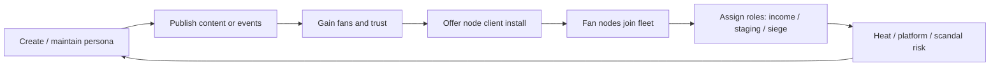

# Expansion Idea — Player Classes: Steamer

> Status: Idea | Last updated: 2026-06-20  
> **Not MVP scope.** Default MVP assumes a single implicit class: the **Operator** (direct hack → claim → harden → fleet).

## Pitch

Port 0 today models fleet growth as **technical conquest**: scan, break in, claim machines, assign roles, siege. That loop fits the Operator fantasy — lone terminal jockey building a drone empire.

The **Steamer** is an alternate **player class** with the same end goal (a usable fleet in the shared world) but a different **skill expression and risk profile**:

- Grow **fans** instead of (or in addition to) raw hacking reputation.
- Convince fans to install **voluntary node software** on their personal machines.
- Those nodes form the Steamer's **fleet** — many weak endpoints, socially sourced rather than seized.

Where the Operator wins through trace pressure and tool tiers, the Steamer wins through **audience, trust, and distribution** — with unique failure modes (platform bans, fan churn, scandal heat).

## Design pillars (Steamer-specific)

| Pillar | Operator (implicit MVP) | Steamer |
|--------|-------------------------|---------|
| Primary stat | Rig power, tool levels, cyberware | Charisma, reach, trust, brand |
| Fleet source | Claimed compromised servers | Fan-installed client nodes |
| Core tension | Trace timer during hacks | Reputation / platform / legal heat from visibility |
| Siege style | Concentrated drone stats | Swarm, attrition, social disruption |
| Weakness | Slow early fleet if bad at hacks | Fragile fleet if fans leave; caps on node quality |

Both classes share the same world, subnets, sieges, and economy shell — they differ in **how** they acquire and maintain fleet capacity.

---

## Class fantasy

You are not breaking into corp mainframes first. You are **on camera**, **in chat**, **in DMs** — building a persona that makes people *want* to help you. Your "exploit" is social: a download link framed as a game mod, a crypto miner "for the cause," a screensaver that donates cycles to your mesh.

Your fleet is **distributed and consent-based (in fiction)** but still game-mechanically real: fan nodes appear in your fleet panel with uptime, bandwidth, and loyalty stats instead of security component levels.

---

## Core loop (Steamer)



**Parallel to Operator loop:** scan → hack → claim → harden → income → siege.

**Steamer translation:** stream → engage → convert → deploy client → manage loyalty → income → siege — while managing **visibility heat** (distinct from subnet heat).

---

## Fans

Fans are a Steamer-specific resource (not shared with Operators at MVP).

| Concept | Purpose |
|---------|---------|
| **Fan count** | Pool size; caps how many active nodes you can sustain |
| **Trust** | Conversion rate: streams/views → installs; decays if you break promises |
| **Engagement** | Tick modifier for fan growth; spent on "events" (giveaways, raids, collabs) |
| **Loyalty** (per node cohort) | Reduces churn when scandal or platform strikes hit |

Fans are **not** other player accounts at first — they are NPC audience generated by Steamer actions (similar to proc-gen machines). Player-to-player fan transfer could be a later social feature.

### Fan → node conversion

- Steamer publishes **content actions** (tick-queued or real-time "go live" windows).
- Each action rolls conversion: `new_nodes = f(fan_count, trust, engagement, content_type, scandal_modifier)`.
- Installed nodes enter fleet as **`fan_node`** type with template stats from `content/balance/steamer-nodes.json` (placeholder).

**Decision (idea):** Fan nodes are weaker per unit than claimed drones but cheaper to replace and faster to accumulate mid-game.

---

## Fleet differences

| Attribute | Operator drone | Steamer fan node |
|-----------|----------------|------------------|
| Acquisition | Hack + claim | Fan install event |
| Loss on siege | Destroyed / reclaimed | Uninstall / churn |
| Hardening | Player installs security SW | "Community moderators," obfuscation skins |
| Trace link to owner | Recon tools, log fingerprints | Harder default attribution; easier bulk takedown |
| Income | Passive drone tick rate | Donations + ad-share + micro-miner yield |
| Max quality ceiling | High (L3+ claimed servers) | Low–mid (personal hardware templates) |

Fan nodes use the same **fleet role tags** (staging, passive_income, defensive) for siege aggregation, but Steamer siege loadouts emphasize **quantity and viruses** over raw CPU stacks.

---

## Skillset (class abilities)

Steamer skills are **orthogonal** to Operator tool tiers. Both may buy generic market tools, but class actions differ.

### Content & audience

| Skill / action | Effect |
|----------------|--------|
| **Go live** | Real-time window: bonus engagement, higher conversion, +visibility heat |
| **VOD drop** | Tick action: slower growth, lower heat spike |
| **Collab raid** | Temporary cross-promotion with NPC or player Steamer (future) |
| **Giveaway** | Spend crypto → engagement burst → trust spike or crash on outcome |

### Distribution

| Skill / action | Effect |
|----------------|--------|
| **Soft pitch** | Low conversion, low heat — "utility app" framing |
| **Hard pitch** | High conversion, scandal risk — obvious miner / botnet tone |
| **Bundle drop** | Ship node client with cosmetic or single-player minigame wrapper |
| **Referral chain** | Existing fans recruit sub-fans; pyramid risk if detected |

### Defense & obfuscation

| Skill / action | Effect |
|----------------|--------|
| **Plausible deniability** | Delay attribution in recon rolls |
| **Community shield** | Absorb one platform strike per tick window |
| **Rotate persona** | Reset scandal meter partial; costs fan trust globally |

### Operator-only contrast (unchanged for MVP class)

Operators retain exclusive efficiency on: direct hack sessions, shell exfil, high-tier claim targets, cyberware rig scaling, and L2+ hardening.

**Decision (idea):** Steamers can still hack, but at a penalty (slower tools, higher trace) unless they invest hybrid cyberware — optional build path, not required.

---

## Heat and consequences

Steamers interact with existing **subnet heat** and **faction punishment**, plus a new meter:

### Visibility heat

Separate from subnet scan heat. Rises when:

- Fan count crosses thresholds
- "Go live" during high subnet activity
- Failed scandal checks after hard pitches
- Viral siege streams (optional UI flavor)

High visibility heat triggers:

- Platform **strikes** (temporary fan growth freeze, node uninstall wave)
- **Media landmark** attention (NPC contracts against the Steamer)
- Increased **government faction** interest (prison path still applies if caught on owned infra)

Criminal faction hospital path could flavor as "creator rehab" or account suspension narrative — same mechanical prison/hospital timers.

---

## Economy hooks

| Income source | Notes |
|---------------|-------|
| Fan donations | Tick income scaled by loyalty |
| Ad share | Lower variance than donations; platform cut sink |
| Node yield | Weaker than Operator passive drone income per node |
| Sponsorship contracts | NPC missions requiring minimum fan count |
| Merch / cosmetic | Future sink; optional monetization alignment |

Steamers spend crypto on: engagement events, persona cosmetics, obfuscation upgrades, and generic market tools (at Operator efficiency penalty unless hybrid build).

---

## PvP and sieges

- **Attack:** Steamers excel at **swarm sieges** — many low-HP nodes, virus spam, engagement-powered "raid hour" buffs if defenders don't respond in interactive window.
- **Defend:** Fan nodes churn when under siege; Steamer skills shift to **morale** actions (rally stream) that reduce uninstall rate during interactive phase.
- **Recon:** Attacking a Steamer fleet may reveal **persona handle** before individual node ownership — inverted from Operator hidden drone ownership.

**Open question:** Can Operators siege Steamer fan nodes without knowing they belong to a player? Proposal: fan nodes look like generic residential machines until recon confidence threshold.

---

## UI surfaces (future)

| Surface | Steamer-specific content |
|---------|---------------------------|
| Persona panel | Handle, brand tags, scandal meter, visibility heat |
| Audience | Fan count, trust, engagement, recent content log |
| Distribution | Active pitches, install rate graph, node world map |
| Fleet | Same aggregate view; nodes tagged `fan` with loyalty bars |

MVP Uplink-style windows remain; Steamer adds a **Broadcast** surface instead of or alongside deep Process Manager emphasis.

---

## Onboarding

**Decision (idea):** Class pick at account creation (post-MVP), after OAuth:

1. Choose **Operator** or **Steamer** (irreversible at first; respec TBD).
2. Tutorial subnet branch: Operator → hack L1 target; Steamer → first 10 fan nodes via guided "soft pitch."
3. Both converge on: earn crypto → participate in economy → first siege exposure.

Throw-in-deep onboarding from MVP spec applies to Operators; Steamers need equivalent **"you already have 50 fans waiting"** cold open.

---

## Content and data (placeholder)

Future content files (not implemented):

```
content/
  balance/
    steamer-nodes.json    # fan node stat templates
    steamer-heat.json     # visibility heat curves
  classes/
    steamer-skills.json   # action definitions
    operator-baseline.json
```

Account schema extension (conceptual):

- `class: 'operator' | 'steamer'`
- `steamer_stats: { fans, trust, engagement, scandal, visibility_heat }`
- Fleet entries: `source: 'claimed' | 'fan_node'`

---

## Phasing recommendation

| Phase | Deliverable |
|-------|-------------|
| **MVP** | Operator only (status quo) |
| **Phase 2 — PvP polish** | Document class APIs; fan nodes as NPC-only siege targets for testing swarm math |
| **Phase 3 — Groups** | Steamer playable; collab raids; crew mixed Operator + Steamer fleets |
| **Phase 4 — Player economy** | Player Steamers sponsor one another; fan transfer between accounts TBD |

---

## Open questions

1. **Naming:** Steamer vs Streamer vs Influencer — lock for fiction tone.
2. **Hybrid builds:** How much hacking can a Steamer do without invalidating Operator identity?
3. **Ethical framing:** Fan nodes as voluntary fiction vs dark-botnet satire — tone guide needed.
4. **Fan cap vs node cap:** Limit fans, active nodes, or both?
5. **Cross-class crews:** Shared fleet UI or separate sub-fleets under crew banner?
6. **Real-time requirement:** Must "go live" be real-time WS sessions or tick-queued events?

---

## Success criteria (when implemented)

A new Steamer player can, without dev help:

1. Pick Steamer at onboarding and complete a fan-growth tutorial.
2. Grow fan count and convert at least one cohort to active fan nodes.
3. Assign node roles and earn tick income from donations/yield.
4. Declare or defend in a siege using swarm-oriented loadout.
5. Experience a platform strike or scandal consequence from visibility heat.
6. Recover partially via persona / community skills.

---

## Related docs

- [15-mvp-scope.md](../../spec/15-mvp-scope.md) — MVP boundary; Operator is implicit
- [05-pvp-sieges.md](../../plan/05-pvp-sieges.md) — fleet roles and siege flow to extend
- [04-tick-economy.md](../../plan/04-tick-economy.md) — tick actions slot for content publishes
