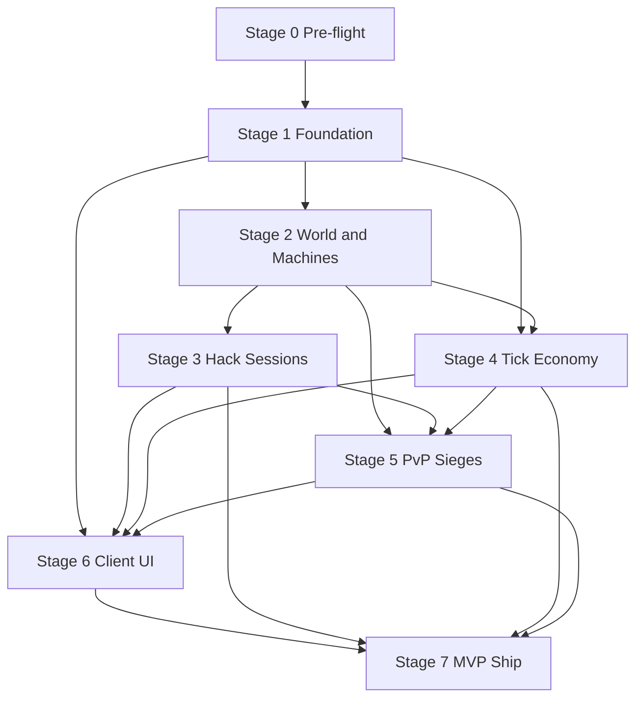

# Port 0 — Implementation Plan

> Generated from spec review | 2026-06-19  
> Source of truth for scope: [spec/15-mvp-scope.md](../spec/15-mvp-scope.md)

This folder turns the design spec into an **actionable build plan**. Work stages in order where dependencies apply; parallel tracks are called out explicitly.

## Spec Summary (Review Notes)

Port 0 is a **server-authoritative multiplayer hacking MMO**: one shared subnet at MVP, hybrid time (real-time hacks + 15-minute ticks), rig vs drone fleet asymmetry, terminal multitasking under trace pressure, and async PvP sieges with hidden ownership.

**Architectural anchors (locked in spec):**

| Area | Decision |
|------|----------|
| Authority | Server simulates everything; client is thin |
| Services | `auth`, `game-api`, `tick-worker` |
| Client | Web primary + Tauri wrapper |
| MVP world | One subnet, proc-gen + 2–3 landmarks |
| Multiplayer | Shared world, solo ops, no comms |
| Economy | Single crypto, NPC market, 15-min ticks |

**Primary risk areas:** real-time session state at scale, shell simulation breadth, siege resolution formulas, and ~20 designer TBDs that block tuning but not all scaffolding.

## Stage Index

| Stage | Document | Outcome | Status |
|-------|----------|---------|--------|
| 0 | [00-pre-flight.md](00-pre-flight.md) | Stack locked, repo scaffolded, TBDs triaged | **Complete** (2026-06-19) |
| 1 | [01-foundation.md](01-foundation.md) | Auth, persistence, deployment skeleton | **Complete** — merged [PR #1](https://github.com/willcipriano/Port-0/pull/1) (2026-06-19) |
| 2 | [02-world-and-machines.md](02-world-and-machines.md) | Subnet, registry, shell sim, OS archetypes | **Next** |
| 3 | [03-hack-sessions.md](03-hack-sessions.md) | Real-time connect → trace → claim loop | Pending |
| 4 | [04-tick-economy.md](04-tick-economy.md) | Scans, market, income, heat, stocks | Pending |
| 5 | [05-pvp-sieges.md](05-pvp-sieges.md) | Fleet, sieges, viruses, recon | Pending |
| 6 | [06-client-ui.md](06-client-ui.md) | Multi-window UI, OAuth flow, SFX | Pending |
| 7 | [07-mvp-ship.md](07-mvp-ship.md) | Content, integration, launch checklist | Pending |

Supporting doc: [TBD-registry.md](TBD-registry.md) — consolidated open design inputs.

## Dependency Graph

## Parallel Tracks (After Stage 1)

Once foundation exists, these can run in parallel with clear API contracts:

| Track | Owner focus | Depends on |
|-------|-------------|------------|
| **Backend sim** | Stages 2 → 3 → 5 | Stage 1 |
| **Tick economy** | Stage 4 | Stages 1–2 |
| **Client** | Stage 6 (stub API first) | Stage 1; wire to 3/4 as ready |
| **Content** | Landmarks, catalogs (Stage 7 + ongoing) | Stage 2 schema |

## MVP Success Criteria (from spec)

A new player can, without dev help:

1. Log in via OAuth  
2. Scan subnet and discover machines  
3. Hack L1 target under trace pressure with multiple tools  
4. Claim and harden a server  
5. Earn crypto and buy a better tool  
6. Serve hospital or prison time when caught  
7. Participate in a siege (attack or defend)  
8. Craft a virus and deploy it in a siege  

Use [07-mvp-ship.md](07-mvp-ship.md) as the final gate.

## Suggested Timeline (Indicative)

Assumes 1–2 engineers full-time; adjust for team size.

| Stage | Duration | Cumulative |
|-------|----------|------------|
| 0 Pre-flight | 1 week | 1 wk |
| 1 Foundation | 2 weeks | 3 wk |
| 2 World & machines | 3 weeks | 6 wk |
| 3 Hack sessions | 3 weeks | 9 wk |
| 4 Tick economy | 2 weeks | 11 wk |
| 5 PvP & sieges | 3 weeks | 14 wk |
| 6 Client UI | 4 weeks (overlap from wk 6) | 16 wk |
| 7 Ship | 2 weeks | 18 wk |

Client work should **start in week 4** with mock APIs; do not wait for full backend.

## How to Use These Docs

1. Complete Stage 0 decision matrix before writing production code.  
2. Each stage ends with **acceptance criteria** — do not advance until met.  
3. When implementing a task, cite the spec section in commit/PR descriptions.  
4. Resolve TBDs in [TBD-registry.md](TBD-registry.md) before tuning-dependent tasks (trace formula, siege resolution, etc.).  
5. Placeholder formulas are acceptable for first integration; mark them `balance-v0` in config.
