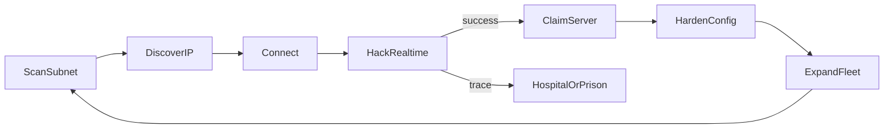
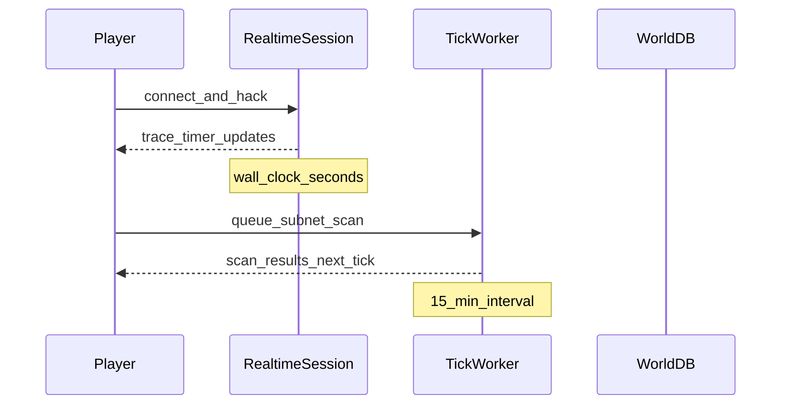

# Core Gameplay Loop

> Status: Draft | Last updated: 2026-06-19

## Overview

The core loop: **scan → discover → connect → hack → claim → harden → expand**. Players spend tick time on discovery and economy, real-time on intrusion, and ongoing effort on fleet management and defense.

## Player Journey

### 1. Scan

Player queues a subnet scan from the rig. Scan speed and range depend on rig power and installed scanner software. Results arrive on the next tick(s).

**Decision:** Scanning is rig-powered and tick-based — the primary gate on expansion rate.

See [04-world-and-topology.md](04-world-and-topology.md).

### 2. Discover

Scan results reveal IPv6 addresses, partial fingerprint data, and zone context. Player selects a target and initiates connection.

### 3. Connect

Player opens a real-time session to the target machine. Shell depth depends on OS archetype and security level.

See [05-machines-and-shells.md](05-machines-and-shells.md).

### 4. Hack

Real-time intrusion. Trace timer runs in wall-clock seconds. Player runs tools (password crackers, trace blockers, exploits) within RAM/CPU limits. Success grants access; failure or trace completion triggers consequences.

See [03-hacking-and-trace.md](03-hacking-and-trace.md).

### 5. Claim

On full compromise, player claims ownership. Machine enters the central registry under the player's account. Owner identity remains hidden to others until recon.

**Decision:** Full ownership — root access, reconfiguration, resource use.

### 6. Harden

Owner manually configures defenses: firewalls, passwords, closed ports, installed security software from the NPC market. No auto-harden beyond what the player installs.

See [05-machines-and-shells.md](05-machines-and-shells.md).

### 7. Expand

Use fleet resources for further scans, sieges, virus deployment, and contract work. Loop repeats.

## Hybrid Time Model

| Subsystem | Clock | Examples |
|-----------|-------|----------|
| Active hack session | Wall-clock real-time | Trace timer, tool runtime, shell interaction |
| World simulation | 15-min tick | Economy, scans, stock moves, offline progress |
| Downtime | Wall-clock real-time | Hospital, prison, virus crafting |

## Online vs Offline

**Decision:** Offline tick progress is enabled.

| Activity | Offline behavior |
|----------|------------------|
| Queued scans | Resolve on tick |
| Economy (passive income, market orders) | Advance on tick |
| Virus crafting | Continues on real-time timer |
| Active hack session | Requires online presence |
| Siege defense (interactive) | Requires online during assault window |
| Hospital / prison | Real-time timers continue |

## Income and Risk Loop

Parallel to expansion, players earn crypto through contracts, loot exfiltration, and passive fleet income. Losses come from market purchases, upkeep, fines, and failed operations. Stock movements on tick can spawn contract opportunities.

See [10-economy-and-market.md](10-economy-and-market.md), [11-progression-and-loot.md](11-progression-and-loot.md).

## Skill Expression

- **Speed:** Completing hacks before trace completes
- **Efficiency:** Running the right tools within RAM/CPU budget
- **Multitasking:** Managing multiple windows during concurrent operations
- **Judgment:** Target selection by faction risk/reward
- **Fleet ops:** Coordinated sieges and defense

See [03-hacking-and-trace.md](03-hacking-and-trace.md), [08-pvp-and-sieges.md](08-pvp-and-sieges.md).
