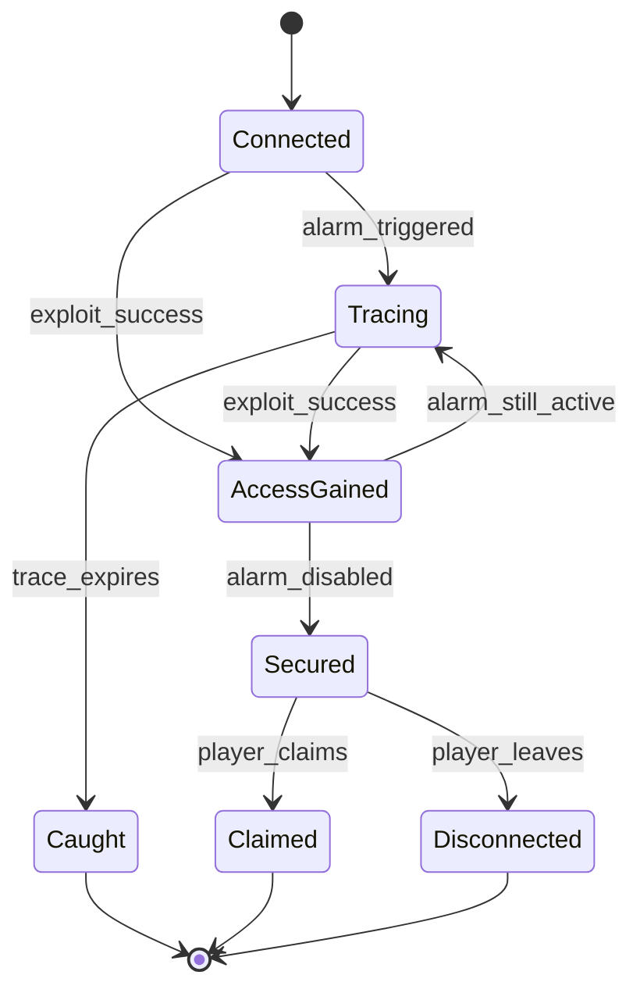

# Hacking and Trace

> Status: Draft | Last updated: 2026-06-19

## Overview

Active intrusion is a **real-time session** between the player's rig and a target machine. The server simulates trace pressure, tool execution, and shell state. The client presents multiple UI surfaces the player operates simultaneously.

## Session Model

1. Player initiates connection to a target IPv6 address.
2. Server creates a hack session with session state (trace timer, running tools, shell access level).
3. Client receives real-time updates (trace progress, tool completion, shell output).
4. Session ends on: successful claim/disconnect, trace completion (caught), or player abort.

**Decision:** Server-authoritative — all actions validated server-side; client is thin.

**Open:** Real-time transport and session state placement — see [17-open-decisions.md](17-open-decisions.md).

## Trace and Alarm Daemon

Each target runs an **alarm daemon** that detects intrusion and initiates a **trace**. The trace is a wall-clock countdown. When it reaches zero, consequences fire based on target faction (see [09-authorities-and-factions.md](09-authorities-and-factions.md)).

### Trace initiation

- Connecting to a vulnerable entry point may start trace immediately or after a detection threshold.
- Failed exploit attempts may accelerate trace.
- Subnet **heat** increases trace speed globally within the subnet.

### Disabling the alarm

A core success path: after gaining access, the player disables the alarm daemon before trace completes. Failure to disable means trace continues even if the player has shell access.

## Tool Resources

**Decision:** Tools consume RAM and CPU on the rig. The player runs a limited number concurrently.

| Resource | Player experience | Server simulation |
|----------|-------------------|-------------------|
| RAM | Slots in task manager; tools cannot start if insufficient | Per-tool RAM cost deducted from rig pool |
| CPU | Affects tool completion speed | Per-tool CPU share affects progress rate |

Tools are installable applications that behave like RPG spells: select tool, target, run — progress bar, completion effect.

See [07-tools-and-viruses.md](07-tools-and-viruses.md), [13-ui-and-ux.md](13-ui-and-ux.md).

## Worked Example: Cracker vs Trace

Target: bank workstation, Password L1, trace in **3 minutes** if alarm triggers.

1. Player starts password cracker (estimated **5 minutes** at current CPU allocation).
2. Trace is active — player will be caught before crack completes.
3. Player starts trace blocker routine (consumes RAM + CPU, extends trace deadline).
4. Blocker pushes effective trace to **7 minutes**.
5. Cracker finishes at 5 minutes. Player logs in with cracked password.
6. Player disables alarm daemon before 7-minute trace expires.
7. Session success — no authority contact.

This is the intended tension: **multitasking under pressure** is not optional optimization, it is the core skill loop.

## Security Level Gating

Tools have a maximum security level they can attack. A Password L1 cracker cannot crack Password L3. Player must upgrade tools via the NPC market.

**Decision:** Numeric component levels (Password L1, Firewall L3, Alarm L2, etc.).

See [05-machines-and-shells.md](05-machines-and-shells.md).

## Layered Entry

Weak targets expose shortcuts:

```
CheapServer OS 1.0
> assume superuser backdoor
Access granted.
```

Advanced targets require tool chains, credential reuse, or virus deployment. Shell depth scales with OS archetype and hardening.

## Trace Speed Formula

`[TBD — owner: designer]`

Inputs to define:

- Base trace speed (target alarm level)
- Subnet heat modifier
- Active countermeasures (trace blocker level, tool tier)
- Rig power modifier
- Faction modifier (gov targets trace faster than shady forums)

## Session Flow



## What the Server Simulates

- Target machine state (services, security levels, alarm status, shell filesystem)
- Running tools and completion timers
- Trace countdown and heat contribution
- Validity of player commands (tool level vs target level, resource availability)

## What the Player Experiences

- Multiple windows: terminal, process manager, trace monitor, connection log
- Real-time countdown on trace indicator
- Tool progress bars and resource meters
- Shell prompt and command responses

See [13-ui-and-ux.md](13-ui-and-ux.md).
