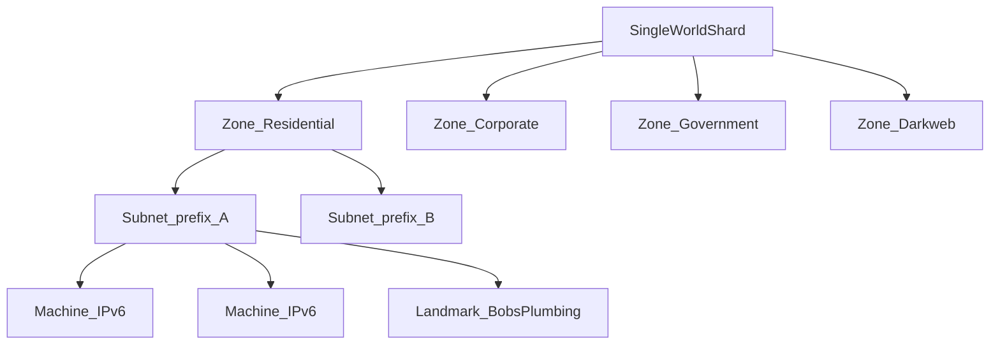

# World and Topology

> Status: Draft | Last updated: 2026-06-19

## Overview

Port 0 simulates an internet of computers — procedurally generated with handcrafted landmarks. The world is a **single shared shard** at launch, designed to scale toward millions of concurrent users without architectural dead ends.

## Structure

**Decision:** Subnets/regions with fixed thematic zones.

### Zones

Fixed regions with consistent themes. Players learn zone character through exploration — no requirement for a visible world map at MVP.

MVP zone: **Shady Hollow** (residential mixed shady). Single subnet **Block 7** at launch.

### Subnets

Each zone contains multiple subnets. A subnet is a shared address prefix and heat pool. Scanning operates at subnet scope.

MVP subnet count: `[TBD — owner: designer]` (MVP is one subnet total — see [15-mvp-scope.md](15-mvp-scope.md))

## IPv6 Addressing

**Decision:** Real IPv6 format. Valid-looking addresses players can copy, share, and connect to directly.

Rules:

- Each machine has a unique IPv6 address
- Anyone with the address can attempt connection
- Address allocation tied to subnet prefix within zone
- Address persistence: machine retains address unless destroyed/replaced `[TBD — owner: designer]`

Allocation scheme: **`2001:db8:<zone>:<subnet>::/64`** — MVP uses `2001:db8:1:7::/64` (zone 1, subnet 7).

## Discovery

**Decision:** Rig-powered scanning, tick-based results.

1. Player selects zone/subnet and queues scan from rig
2. Scan completes on next tick (modified by rig scanner software and bandwidth)
3. Results reveal IPv6 addresses and partial fingerprint data
4. Player connects directly to interesting targets

Scan does not reveal ownership — recon required after connection.

See [02-core-gameplay-loop.md](02-core-gameplay-loop.md), [03-hacking-and-trace.md](03-hacking-and-trace.md).

## Central Registry

Server-side database tracks machine ownership and state. Owner identity is **not exposed** to other players without recon.

The registry is authoritative for:

- Current owner account ID
- Claim timestamp
- Machine resource stats (CPU, RAM, storage)
- Installed security configuration (server-side only)

## Landmarks

Handcrafted machines placed in the proc-gen world. See [18-content-authoring.md](18-content-authoring.md).

## Scaling Path

**Decision:** Event sourcing scope is **Open** — see [17-open-decisions.md](17-open-decisions.md).

Design intent for scale:

| Phase | Approach |
|-------|----------|
| MVP | Single shard, one subnet, vertical scale |
| Growth | Partition subnets across simulation workers |
| Long-term | Event-sourced state changes for replay, audit, and horizontal scale |

Architecture must not assume single-process simulation forever, but MVP does not require full event sourcing on day one.

See [16-technical-architecture.md](16-technical-architecture.md).

## Machine Count

Total machines in MVP subnet: **300 proc-gen + 3 landmarks** (see `content/subnet/mvp-subnet.json`).

Proc-gen fills the subnet; landmarks replace specific slots.

## Player Entry

**Decision:** Throw in deep — no guided tutorial subnet. Starting zone should be survivable but not safe from all consequences.

Starting zone assignment: `[TBD — owner: designer]`

See [11-progression-and-loot.md](11-progression-and-loot.md).
