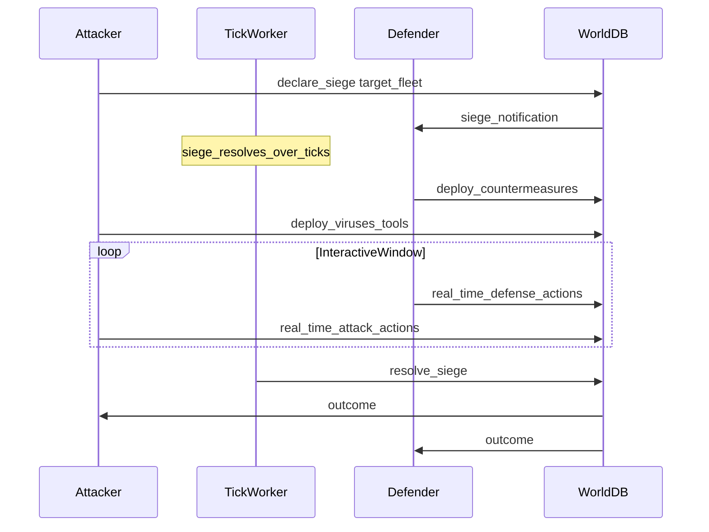

# PvP and Sieges

> Status: Draft | Last updated: 2026-06-19

## Overview

Player conflict occurs through **drone server fleets**, not direct rig combat. The home rig is untouchable. PvP is indirect: attack someone's network infrastructure, capture nodes, steal resources.

**Decision:** Async siege with interactive defense.

## Siege Flow

### Phase 1: Declaration

Attacker targets a known server or fleet segment and commits attack resources (viruses, fleet CPU/RAM allocation). Siege enters queued/active state.

### Phase 2: Interactive window

Defender receives notification. During the assault window, both sides can act in real time:

- **Attacker:** Deploy viruses, escalate exploits, target specific nodes
- **Defender:** Run countermeasures, isolate nodes, activate defensive tools

**Decision:** Defender interaction during siege is supported — not pure auto-resolve.

### Phase 3: Resolution

Siege resolves over tick(s). Outcome determined by fleet stats, loadouts, and actions during the interactive window.

Resolution formula: `[TBD — owner: designer]`

Inputs: attacker fleet aggregate (CPU/RAM/storage), defender fleet aggregate, installed defenses, virus effects, interactive-window actions.

### Phase 4: Outcome

Possible results:

- Attacker captures one or more defender drones (ownership transfer)
- Defender repels attack (attacker loses deployed resources)
- Partial outcome (damage without capture, data theft without ownership change) `[TBD — owner: designer]`

**Decision:** Full stakes — captured servers transfer ownership. Attacker gains drones; defender loses them.

## Hidden Ownership

**Decision:** Ownership is not visible in any public UI. A player must locate a server and run recon to learn who controls it.

### Recon paths

**Decision:** Multiple paths with different reliability.

| Method | Description | Reliability |
|--------|-------------|-------------|
| Dedicated recon tool | Run against target; chance to reveal owner | `[TBD — owner: designer]` |
| Log analysis | Read shell logs and files for fingerprints | Skill-dependent; varies by target hardening |
| Registry intercept | Hack central registry or intercept ownership queries | High reward; high risk |
| Side-channel | Infer owner from fleet behavior, siege history, market patterns | Player deduction |

See [07-tools-and-viruses.md](07-tools-and-viruses.md).

## Rig Exemption

Sieges target **drone servers only**. The personal rig cannot be attacked, sieged, or captured under any circumstances.

## Launch Scope

**Decision:** Shared world with solo ops at launch. Siege mechanics are in MVP scope as part of the one-subnet vertical slice. No player comms at launch — conflict is purely through world actions.

See [12-multiplayer-model.md](12-multiplayer-model.md), [15-mvp-scope.md](15-mvp-scope.md).

## Future: Contracts

Player-created contracts ("hack server X, transfer control for Y crypto") are deferred post-MVP. Architecture should not assume solo-only conflict long term.

See [12-multiplayer-model.md](12-multiplayer-model.md).
