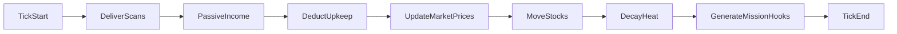

# Economy and Market

> Status: Draft | Last updated: 2026-06-19

## Overview

Port 0 runs a single in-game **cryptocurrency**. The economy advances on **15-minute ticks**. Real-time timers apply to virus crafting and downtime (hospital/prison), not to market price updates.

**Decision:** 15-minute tick interval for economy and simulation.

## Currency

One crypto. Used for all transactions. UI presents it with Bitcoin-like flavor (wallet, transfers, balance) but mechanics are game-defined, not blockchain.

## Income Sources

**Decision:** Mixed economy — no single dominant source.

| Source | Tick? | Description |
|--------|-------|-------------|
| NPC contracts | Tick payout on completion | Jobs from landmarks and contract board `[TBD MVP scope]` |
| Loot sales | On exfiltration | Sell data files, credentials, source code |
| Passive fleet income | Tick | Owned drones generate crypto `[TBD — owner: designer]` rate |
| Stock trading | Tick | Buy/sell on market ticks |
| Siege spoils | On resolution | Crypto/data from captured nodes `[TBD]` |

## Sinks

**Decision:** All sinks active at design level.

| Sink | Description |
|------|-------------|
| NPC market | Tool, software, hardware, cyberware purchases |
| Upkeep | Server maintenance, bandwidth costs per tick |
| Fines | Hospital/prison penalties |
| Bribes | Faction payments to reduce heat `[TBD]` |
| Virus crafting | Resource cost beyond time `[TBD — owner: designer]` |

## NPC Market

**Decision:** NPC market only at launch. Fixed catalog with prices that fluctuate on tick.

### Catalog categories

| Category | Examples |
|----------|----------|
| Tools | Crackers, scanners, trace blockers, recon |
| Security software | Firewalls, AV, log monitors (for drone hardening) |
| Hardware / cyberware | Rig upgrades |
| Consumables | `[TBD — owner: designer]` |

Player-to-player marketplace deferred. See [12-multiplayer-model.md](12-multiplayer-model.md).

## Tick Subsystems

Each 15-minute tick processes:

1. Queued scan results delivered
2. Passive income calculated per owned drone
3. Upkeep deducted
4. Market prices updated
5. Stock prices moved
6. Subnet heat decay
7. Offline queued actions resolved
8. Contract/stock mission hook generation

## Stocks and Mission Hooks

**Decision:** Stocks serve as mission hooks at MVP.

Stock prices move on tick. Significant movements can spawn NPC contracts:

- "Corp X stock dropping — investigate leak at `[IPv6]`"
- "Merger rumor — exfil financial data from `[landmark]`"

Exact hook generation rules: `[TBD — owner: designer]`

Trading mechanics (can players profit from stocks directly?): `[TBD — owner: designer]`

## Offline Economy

**Decision:** Offline tick progress enabled.

While logged out:

- Queued scans resolve
- Passive income and upkeep apply
- Market price changes take effect on next login
- Hospital/prison timers continue (real-time, not tick)

## Inflation Control

`[TBD — owner: designer]`

Design note: track total crypto in circulation, sink rates vs source rates. No numbers until playtesting.

## Future: Player Market

Player-to-player trading and contract escrow deferred. Central registry and ownership model should support transfer without redesign.

See [12-multiplayer-model.md](12-multiplayer-model.md).
