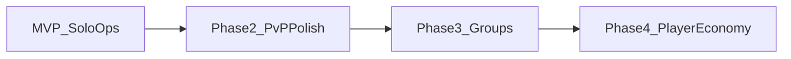

# Multiplayer Model

> Status: Draft | Last updated: 2026-06-19

## Overview

Port 0 is an MMO — one persistent world shared by all players. Launch scope is deliberately narrow: solo operations with world-level interaction, no direct communication.

## Launch (MVP)

**Decision:** Shared world, solo ops.

| Feature | Launch state |
|---------|-------------|
| Shared world | Yes — one subnet, all players in same simulation |
| Server ownership | Yes — players claim drones, visible through world effects |
| PvP sieges | Yes — async siege with interactive defense |
| Hidden ownership | Yes — recon required |
| Player comms | No |
| Leaderboards | No |
| Groups / crews | No |
| Player market | No |
| Player contracts | No |

### How players interact without comms

- Compete for unclaimed machines
- Siege each other's fleets
- Affect shared subnet heat and economy
- Observe market price and stock changes driven by collective activity
- Infer other players from recon and world state

## Identity

**Decision:** Persistent account tied to OAuth login.

In-world identity is separate from account handle for future burner/alias support. At launch, account = operator identity in the central registry (hidden from other players until recon).

## Future Phases

| Phase | Additions |
|-------|-----------|
| MVP | One subnet, solo ops, NPC market, sieges |
| PvP polish | Balance pass, recon depth, corporate security |
| Groups | Crews/guilds, shared fleet pools, internal tools |
| Player economy | Player-to-player market, contract board, escrow |
| Comms | Chat channels (global, subnet, crew) |
| Leaderboards | Opt-in rankings |

Phase ordering and contents subject to designer review after MVP.

## Groups (Deferred)

**Decision:** Solo only at launch. Groups added later.

Design constraints for future crews:

- Shared drone pool or crew treasury
- Crew-only comms channel
- Joint siege operations
- Crew reputation

No schema decisions until phase 3.

## Player Contracts (Deferred)

Future: player posts contract ("gain control of `[IPv6]`, transfer to me for X crypto"). Requires escrow, dispute resolution, and comms.

Architecture should store ownership transfers as atomic registry operations — contract system builds on this.

## Server Count and Player Density

MVP one subnet. Player density per subnet: `[TBD — owner: designer]`

Long-term: multiple subnets/zones per shard, region-based partitioning.

See [04-world-and-topology.md](04-world-and-topology.md), [15-mvp-scope.md](15-mvp-scope.md).
