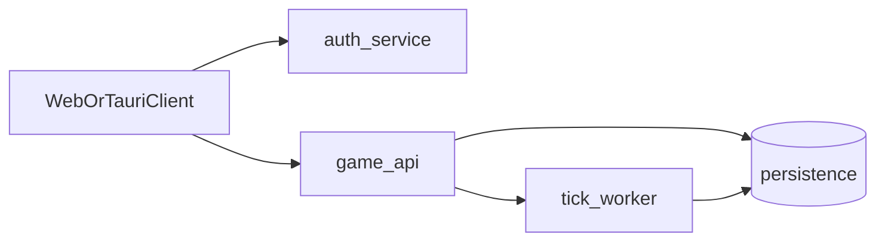
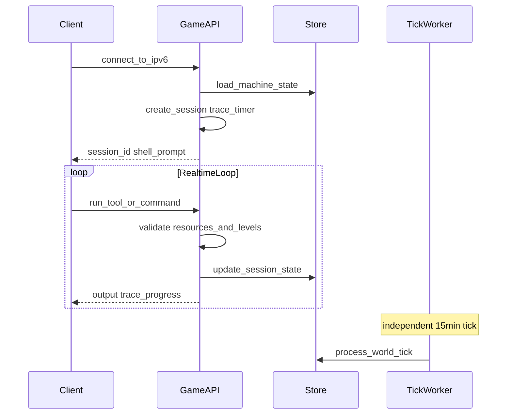

# Technical Architecture

> Status: Draft | Last updated: 2026-06-19

## Overview

Port 0 backend is **server-authoritative** with a **minimal microservices** split at MVP. Client is thin (web + Tauri). Deployment is cloud-managed.

## Services (MVP)

**Decision:** Three services at launch.

### auth

- OAuth login and token issuance
- Account creation and session management
- Maps OAuth identity to game account ID

**Open:** OAuth providers — GitHub + Google. **Decision:** [17-open-decisions.md](17-open-decisions.md)

### game-api

- All player actions during online play
- Hack session management (real-time)
- Machine state reads/writes
- Market purchases, fleet management
- Siege declaration and interactive defense actions
- Validates all client requests against authoritative state

### tick-worker

- Runs every 15 minutes
- Processes: scan delivery, passive income, upkeep, market/stock updates, heat decay, mission hook generation, offline queue resolution, siege phase resolution
- Writes results to persistence; notifies connected clients via game-api push/poll

## Authority Model

**Decision:** Server-authoritative.

| Rule | Enforcement |
|------|-------------|
| Tool level vs target level | game-api rejects invalid tool use |
| RAM/CPU budget | game-api tracks running processes |
| Trace timer | Server-side countdown; client displays |
| Shell commands | Server pattern-matches against archetype; returns simulated output |
| Ownership transfer | Atomic registry update; no client-side claim |
| Economy transactions | Validated against server-side balance |

Anti-cheat at MVP = authoritative simulation, not client-side obfuscation.

## Data Flow: Hack Session

**Decision:** WebSockets on game-api for hack sessions and sieges.

**Decision:** Hack session state in Redis (`hack:{session_id}`); game-api workers stateless.

## Data Flow: Tick

1. tick-worker wakes on schedule
2. Loads pending scans, sieges, economy state from persistence
3. Computes tick results (deterministic given inputs + seed)
4. Writes state updates
5. Pushes notifications to game-api for connected clients

Offline players receive results on next login if not connected during tick.

## Persistence

**Decision:** PostgreSQL + Redis. PG for authoritative state; Redis for hot sessions and pub/sub.

Expected entity groups:

| Entity | Examples |
|--------|----------|
| Accounts | OAuth ID, rig stats, crypto balance, cyberware |
| Machines | IPv6, OS archetype, components, filesystem blob, owner |
| Sessions | Active hack sessions, running tools, trace state |
| Fleet | Player → owned machine list |
| Economy | Market catalog, price history, stock state |
| World | Subnet config, heat levels, landmark placements |
| Events | `[TBD]` — depends on event sourcing scope decision |

## Event Sourcing

**Decision:** Audit trail only — log ownership, economy, and siege mutations; no full event-sourced rebuild at MVP.

## Client Stack

- Web frontend: **React + TypeScript**
- Tauri desktop wrapper wrapping same frontend
- OAuth redirect flow in browser; Tauri uses embedded webview

**Decision:** flexlayout-react for docking, tabs, and layout persistence (Stage 6).

**Decision:** Frontend framework — React + TypeScript. Windowing — flexlayout-react.

## Deployment

**Decision:** Cloud-managed.

| Component | Deployment |
|-----------|------------|
| auth | Container service, horizontally scalable |
| game-api | Container service, horizontally scalable; sticky sessions if needed |
| tick-worker | Single leader or scheduled job; idempotent tick processing |
| persistence | Managed database service |
| static assets | CDN or object storage |

Specific cloud provider: **Fly.io** (MVP default; see [17-open-decisions.md](17-open-decisions.md))

## Scaling Path (Post-MVP)

| Concern | Direction |
|---------|-----------|
| More players | Scale game-api horizontally |
| More subnets | Partition tick-worker by subnet/zone |
| Hack session load | Dedicated session workers + shared hot state store |
| Persistence | Read replicas, shard by zone |
| Events | Event stream for replay and audit if ES scope expands |

## Security

- Closed source
- OAuth for identity; game tokens for API auth
- Rate limiting on game-api `[TBD — thresholds]`
- Input validation on all shell commands and tool actions
- No arbitrary code execution on server from player input

See [03-hacking-and-trace.md](03-hacking-and-trace.md), [05-machines-and-shells.md](05-machines-and-shells.md).

## Language / Runtime

**Decision:** TypeScript monorepo — auth, game-api, tick-worker, client, and shared types in one repo.
